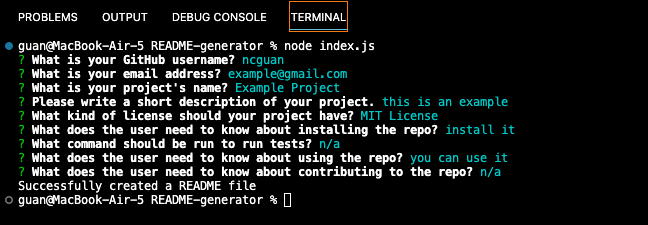
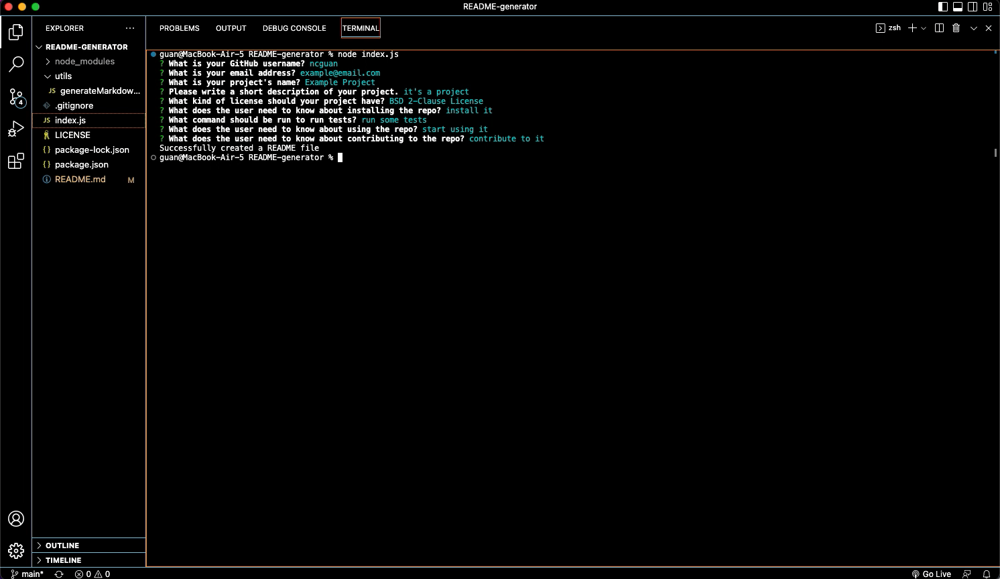

# README Generator



## Description
This project was built to be able to quickly generate a README for a new project through the command-line. Once the application has been initialized through the command-line, the user will be prompted for information about their project repository. Once the user has input their project information, a generate-README.md file will be generated with the project title, description, table of contents, installation, usage, license, contributing, tests, and questions section. 

## Technologies Used
- JavaScript
- Git
- GitHub
- Node.js

## Usage
In the command line run:
```console
node index.js
```
When prompted, answer the prompted questions about your project repository. After answering all the prompted questions, the message "Successfully created a README file" will be displayed and a generated-README.md file will be created.

## License
Please refer to the LICENSE in the repo.

## Author Links
[GitHub](https://github.com/ncguan)